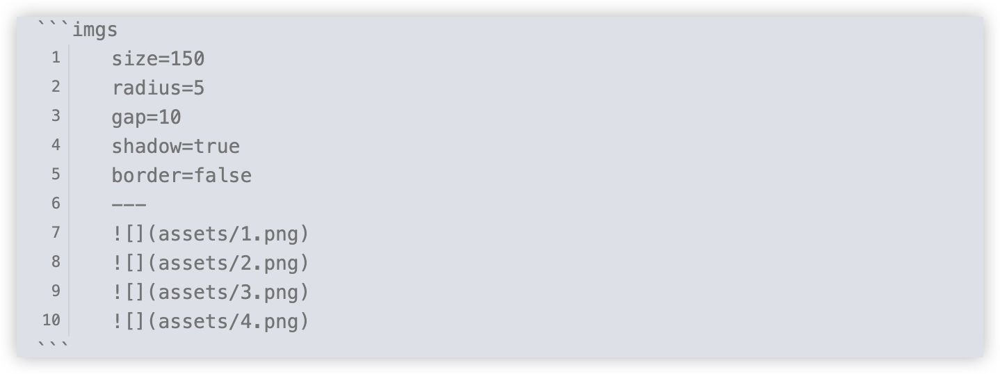

### ✅ How to Use

1. Create a code block with the language set to imgs.
2. Inside the block, insert your image markdown

### ⭐ Optional Settings

| Option | Description                    | Default | Available options |
| ------ | ------------------------------ | ------- | ----------------- |
| size   | Image width and height in `px` | 220     | 50~500            |
| radius | Border radius in `px`          | 10      | 0~50              |
| gap    | Space between images in `px`   | 10      | 0~50              |
| shadow | Show drop shadow or not        | false   | false / true      |
| border | Show border around images      | false   | false / true      |
