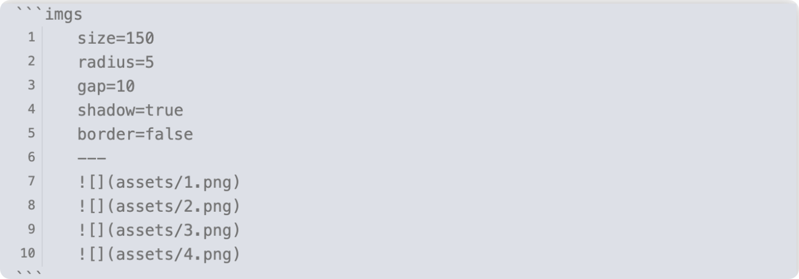

<div align="center"><a href="i18n/README.zh.md">中文</a> ｜ English</div>

<br>
<br>
<br>


Obsidian Image Cluster helps you easily combine multiple images together in your notes, making your note interface more beautiful and organized.



## ⬇️ Installation

### From Community Plugins (Recommended)

You can install the plugin directly from Obsidian's Community Plugins browser:

1. Open Obsidian and go to Settings > Community plugins
2. Click on Browse and search for "Image Cluster"
3. Click Install and then Enable the plugin
   
You can also install the plugin directly from its Community Plugins entry: [Image Cluster on Obsidian](https://obsidian.md/plugins?id=image-cluster).

### Manual Installation

1. Download the latest release from [GitHub Releases](https://github.com/tcyeee/obsidian-image-cluster/releases)
2. Extract main.js, manifest.json, and styles.css to your vault's `.obsidian/plugins/image-cluster/` directory
3. Reload Obsidian and enable the plugin in Settings → Community plugins


## ✅ How to Use

1. Right‑click on an image link and choose “Wrap the images into a group”.


2. In **Reading mode**, click the “Settings” button at the top‑right corner of an image group to customize its style.


## ⚙️ Configuration

The style configuration of an image group is stored in the first line of the `imgs` code block and ends with `;;`.  
You can manually tweak the parameters there for deeper customization.

````text
```imgs
size=150&gap=8&radius=10&shadow=false&border=false;;


```
````

### Optional parameters

| Option | Description                    | Default | Available options |
| ------ | ------------------------------ | ------- | ----------------- |
| size   | Image width and height in `px` | 150     | 50~500            |
| radius | Border radius in `px`          | 10      | 0~50              |
| gap    | Space between images in `px`   | 8       | 0~50              |
| shadow | Show drop shadow or not        | false   | false / true      |
| border | Show border around images      | false   | false / true      |
| hidden | hidden images                  | false   | false / true      |

